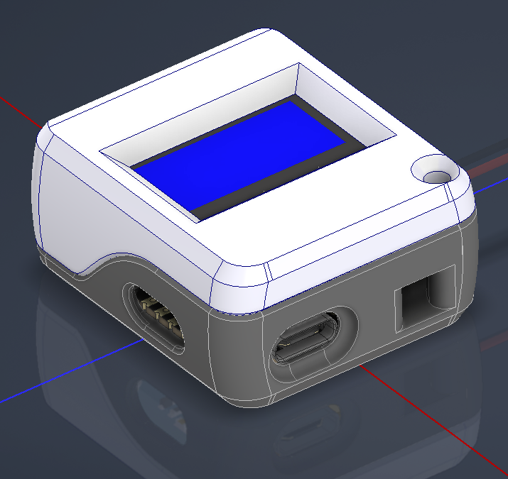
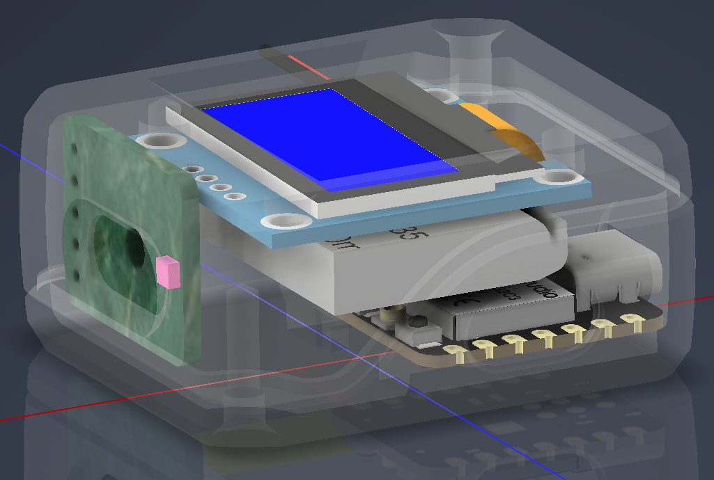

# ltr390-uv-meter

**About £15 of parts that tell you how strong the sun is right now. One switch, two numbers, no app.**

[](https://github.com/ashbmstu/ltr390-uv-meter/actions/workflows/ci.yml)
[](LICENSE)


A pocket UV index and light meter built from four parts and about a dozen solder
joints: a Seeed Studio XIAO ESP32-C3, an LTR390 sensor, a 0.96-inch OLED and a
small lithium cell. Slide the switch and it shows the UV index and the light
level in lux, about once a second, until the battery runs down.

No app, no pairing, no account, no radio. It is a meter.

<p align="center">
  
</p>

## What it shows

| | |
|---|---|
| **UV index** | Two decimal places, derived from the sensor's UVA channel |
| **Light level** | Illuminance in lux, from the same sensor's visible channel |
| **Update rate** | A little under once a second — a 500 ms pause plus the time the sensor needs to convert both channels |
| **Display** | 128×64 monochrome OLED, characters drawn at double size so it reads at arm's length in sunlight |
| **Size** | 42 × 38 × 20 mm assembled — it fits in a pocket |
| **Power** | One lithium cell, charged over the USB-C port on the board. A slide switch cuts the battery completely, so a meter left in a drawer is genuinely off |

## What you need

| Part | Approx. |
|------|--------|
| Seeed Studio XIAO ESP32-C3 | ~£5 |
| LTR390 UV sensor breakout | ~£5 |
| 0.96-inch I²C OLED, 128×64, SSD1306 or GM009605 | ~£3 |
| Li-ion cell, 503035 (50 × 30 × 3.5 mm, about 500 mAh) | ~£3 |
| SPDT slide switch, 3-pin | ~£1 |
| Printed case, a few grams of filament, and small self-tapping screws | |

You also need a soldering iron, some thin wire and a USB-C data cable. Full
detail and a wiring diagram are in [docs/hardware.md](docs/hardware.md).

## Quick start

Five steps. There is no toolchain to install and nothing to compile —
MicroPython runs the files as they are.

1. **Put MicroPython on the board.** Plug the XIAO into your computer with a
   USB-C cable and follow [docs/flashing.md](docs/flashing.md). It takes about
   five minutes and you only ever do it once.
2. **Copy three files.** Open Thonny, connect to the board, and copy
   `src/main.py`, `src/ltr390.py` and `src/ssd1306.py` onto it. They must sit at
   the top level, not inside a folder.
3. **Wire it up.** Four wires to the sensor, four to the screen, and the battery
   through the switch. The diagram in [docs/hardware.md](docs/hardware.md) shows
   every joint.
4. **Print the case.** The files are on
   [Thingiverse](https://www.thingiverse.com/thing:7280742).
5. **Slide the switch.** The screen lights up and starts counting. Take it
   outside.

If the screen stays dark or shows `Init: FAIL`, go to
[docs/troubleshooting.md](docs/troubleshooting.md) — the two usual causes are a
swapped pair of wires and the sensor soldered to the wrong pins.

## Reading the numbers

The top line is the UV index, on the same scale weather forecasts use.

| UV index | What it means | What to do |
|---|---|---|
| **0 – 2** | Low | Nothing. Stay out as long as you like |
| **3 – 5** | Moderate | Hat and sunscreen. Find shade around the middle of the day |
| **6 – 7** | High | Sunscreen, hat, sunglasses. Shade between 11am and 3pm |
| **8 – 10** | Very high | Cover up properly. Skin burns quickly |
| **11 +** | Extreme | Stay out of the sun. Unprotected skin burns in minutes |

Indoors you will usually see `0.00`. A bright overcast day gives one or two. Clear
summer sun in northern Europe reaches six or seven; the tropics and high mountains
go past eleven.

The bottom line is lux — how bright it looks to a human eye. A lit room is a few
hundred, an overcast day a few thousand, direct sun tens of thousands. The two
numbers measure different things: a UV lamp can show high UV and almost no lux,
and a bright indoor lamp the exact opposite.

## What you can use it for

- **Deciding when to cover up.** A forecast gives one number for a whole city at
  noon. This gives the number where you are actually standing, under that tree, at
  four in the afternoon.
- **Testing whether things really block UV.** Take a reading in the sun, then hold
  sunglasses, a car window, window film, a hat or a UV-blocking shirt over the
  sensor and read it again. Good sunglasses drop it to almost nothing. Some cheap
  ones barely move it.
- **Checking UV lamps.** Nail-curing lamps, resin-curing stations, blacklights,
  reptile lamps and plant lamps fade with use and eventually stop emitting while
  still lighting up. This tells you which ones have gone.
- **Teaching.** Shade against sun, cloud against clear sky, morning against midday,
  water and snow bouncing UV back upwards. All of it shows up in seconds, and a
  child can hold the thing and run the experiment themselves.

> [!WARNING]
> **The LTR390 measures UVA. It cannot see UVC at all.** Do not use this to check
> a germicidal lamp, a UV steriliser or a water-treatment lamp — a dead tube and a
> working one read exactly the same, which is worse than not measuring. Those lamps
> also damage eyes and skin quickly. Use a meter made for UVC.

## How it works

```
LTR390 ──software I²C──▶ XIAO ESP32-C3 ──hardware I²C──▶ SSD1306 OLED
UVA + visible               main.py                        128×64
GPIO4 / GPIO3                  ▲                       GPIO7 / GPIO6
                               │
               Li-ion 503035 through a slide switch
```

<p align="center">
  
</p>

There are two I²C buses, and that is deliberate. The sensor would not respond on
the hardware controller that drives the display, so it gets a software bus of its
own on GPIO4 and GPIO3. Tidying that into one shared bus is the first thing anyone
tries, and it does not work.

The LTR390 has a single converter shared between a UVA photodiode and a
visible-light photodiode, so the firmware reads the two channels by switching
modes rather than at once. The UV index is the raw UVA count divided by the
sensor's rated sensitivity, corrected for the gain and resolution in use.
[docs/measurement.md](docs/measurement.md) works through the arithmetic and says
how far to trust the answer.

## Limitations

Stated plainly, because they follow from the sensor and will not change:

- **This is a UVA meter reporting a UV index.** The real UV index is a weighted sum
  across UVA and UVB. The LTR390 sees only UVA and scales it. Outdoors in daylight
  the two track each other closely enough to be useful; under an artificial source
  with a different spectrum they need not agree at all.
- **There is no calibration step.** The conversion uses the sensitivity figure from
  the datasheet, not a measurement of your particular sensor against a reference
  instrument. Treat readings as good to a fraction of an index point, not to the two
  decimal places the screen shows.
- **No diffuser, so aim matters.** A proper meter has a cosine-corrected diffuser
  that weights light by the angle it arrives from. This has a bare sensor behind a
  hole. Point the window at the sky, and compare readings taken the same way.
- **UV and lux are not simultaneous.** They are taken a few tens of milliseconds
  apart, because the two channels share one converter.
- **No logging, no wireless, no battery gauge.** The screen shows the present moment
  and nothing else. The board's radio is never switched on.
- **Battery life has not been measured.** The display and the ESP32-C3 both run
  continuously — there is no sleep mode — so expect hours rather than days, and
  switch it off when you have finished.

## The case

The printed enclosure, both halves and the STEP source, is on Thingiverse:
**[thing:7280742](https://www.thingiverse.com/thing:7280742)**. It prints without
supports and takes a few grams of filament.

The case is published under a Creative Commons Attribution-ShareAlike licence,
which is not the licence covering the firmware here. See [NOTICE](NOTICE).

## Documentation

| | |
|---|---|
| [flashing.md](docs/flashing.md) | Installing MicroPython and copying the three files. **Start here.** |
| [hardware.md](docs/hardware.md) | Parts, wiring diagram, every connection, assembly order |
| [measurement.md](docs/measurement.md) | How UV index and lux are worked out, and how far to trust them |
| [troubleshooting.md](docs/troubleshooting.md) | Symptom-first fault finding |

## Project status

Working and in use. Version 0.1.0 — see [CHANGELOG.md](CHANGELOG.md).

## Contributing

Reports from a device you have built are the most useful thing, especially readings
taken alongside a calibrated meter. See [CONTRIBUTING.md](CONTRIBUTING.md).

## Licence

MIT — see [LICENSE](LICENSE). Third-party attributions in [NOTICE](NOTICE).

`src/ssd1306.py` is the MicroPython project's SSD1306 driver, carried unmodified.
`src/ltr390.py` follows the register map and conversion arithmetic of Adafruit's
CircuitPython LTR390 library. The printed case is Creative Commons
Attribution-ShareAlike.
