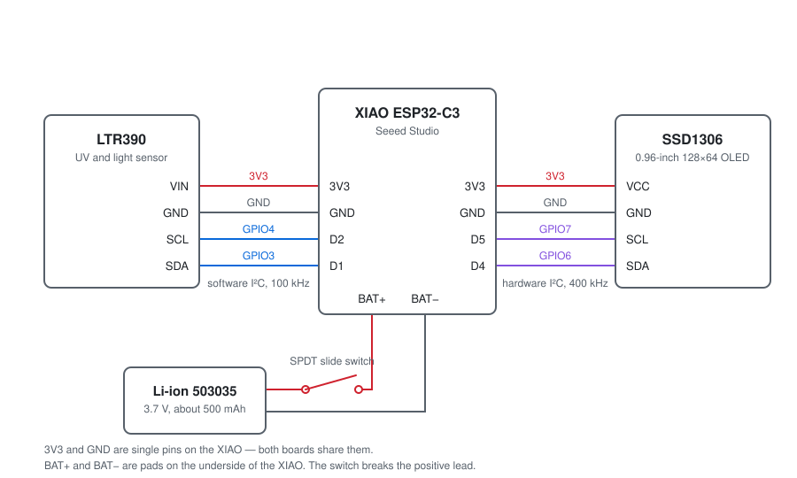

# Hardware

Parts, wiring and assembly. About a dozen solder joints and no circuit board.

## Parts

| Part | Notes |
|---|---|
| **Seeed Studio XIAO ESP32-C3** | Any revision. The USB-C port both programs the board and charges the cell |
| **LTR390 breakout** | Adafruit's board or any of the generic clones. All of them sit at I²C address `0x53` |
| **0.96-inch OLED, 128×64, I²C** | SSD1306 controller, or the GM009605 modules that use it. Four pins, usually at address `0x3C`. An SPI module will not work without changing the firmware |
| **Li-ion cell, 503035** | 50 × 30 × 3.5 mm, about 500 mAh. Buy one **with a protection circuit** — the board has no low-voltage cut-out of its own |
| **SPDT slide switch, 3-pin** | Sits in the battery's positive lead |
| **Printed case** | [thing:7280742](https://www.thingiverse.com/thing:7280742), plus small self-tapping screws |

Thin stranded wire is easier to route inside the case than solid core, and
28 AWG is plenty for the current involved.

## Wiring

  

| From | To | XIAO pin | GPIO |
|---|---|---|---|
| LTR390 `VIN` | XIAO `3V3` | 3V3 | — |
| LTR390 `GND` | XIAO `GND` | GND | — |
| LTR390 `SCL` | XIAO `D2` | D2 | GPIO4 |
| LTR390 `SDA` | XIAO `D1` | D1 | GPIO3 |
| OLED `VCC` | XIAO `3V3` | 3V3 | — |
| OLED `GND` | XIAO `GND` | GND | — |
| OLED `SCL` | XIAO `D5` | D5 | GPIO7 |
| OLED `SDA` | XIAO `D4` | D4 | GPIO6 |
| Cell `+` | switch, then XIAO `BAT+` | BAT+ | — |
| Cell `−` | XIAO `BAT−` | BAT− | — |

`3V3` and `GND` are single pins on the XIAO. Both boards share them, so those two
pins each take two wires.

`BAT+` and `BAT−` are pads on the **underside** of the XIAO, not part of the pin
headers. Tin them before trying to attach a wire.

## Why two I²C buses

The display runs on the ESP32-C3's hardware I²C controller at 400 kHz. The sensor
gets a separate bit-banged bus on GPIO4 and GPIO3 at 100 kHz, because it would not
respond on the hardware controller alongside the display.

Both devices have different addresses and would, in principle, share one bus
happily. In practice this build does not. Anyone rewiring it onto a single bus
should expect the sensor to stop being detected, and should change
`PIN_LTR_SCL` and `PIN_LTR_SDA` in `src/main.py` to match whatever they do
instead.

## Assembly order

The case is tight, so the order matters.

1. Solder the two battery wires to the underside pads of the XIAO **first**,
   while the board is still flat on the bench. Fit the switch into the positive
   lead.
2. Solder the four display wires and the four sensor wires. Keep them short —
   about 25 mm is enough, and slack has nowhere to go.
3. Test the whole thing on the bench before it goes in the case. The screen should
   show two lines of numbers.
4. Fit the LTR390 into the end of the base so its sensor faces the window, then
   the cell, then the XIAO, then the display under the lid.
5. Close the case and fit the screws.

## The case

Both halves and the STEP source are on Thingiverse:
[thing:7280742](https://www.thingiverse.com/thing:7280742). Assembled it is
42 × 38 × 20 mm. It prints without supports.

The sensor looks out through an open hole, with no plastic in the light path.
Covering that hole with a clear print or a window will change every reading — most
filaments and acrylics block a lot of UV.

## Charging

The XIAO charges the cell whenever a USB-C cable is connected. The charge rate is
set by the board.

**The switch must be ON to charge.** It sits in the positive lead between the cell
and the board, so with the switch off the cell is disconnected from the charger as
well as from the ESP32. A meter left on the charger switched off will be flat in
the morning.

## Related

- [flashing.md](flashing.md) — getting the firmware onto the board
- [troubleshooting.md](troubleshooting.md) — when something does not light up
